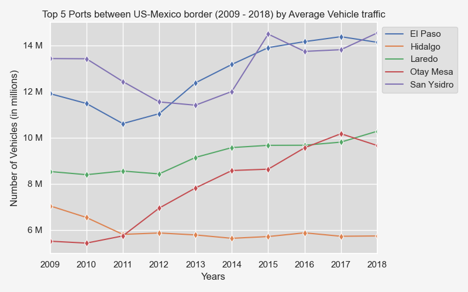
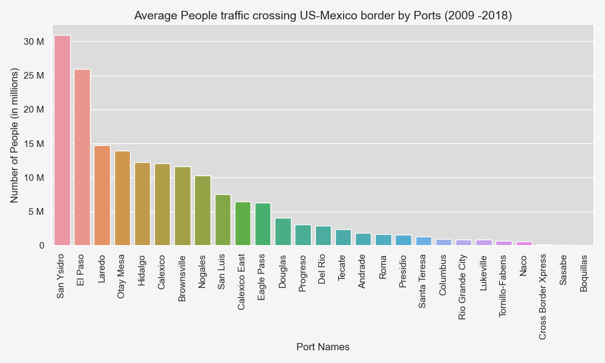
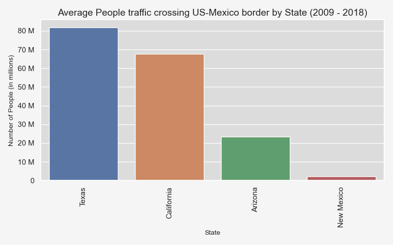
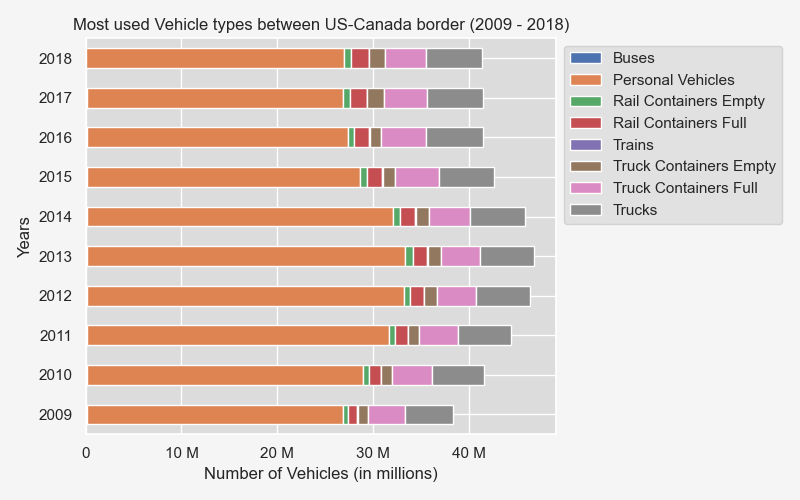
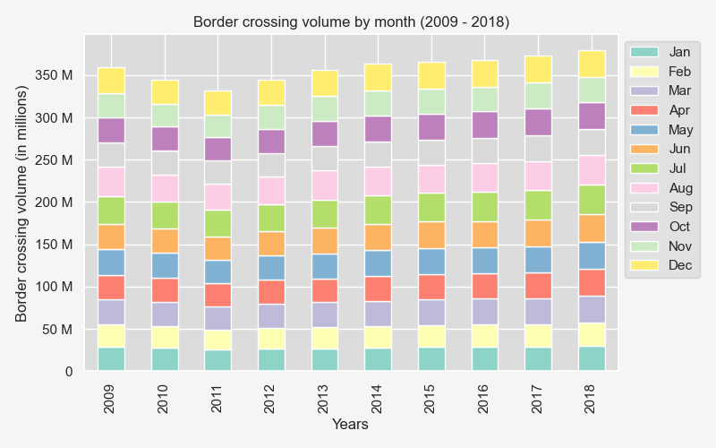
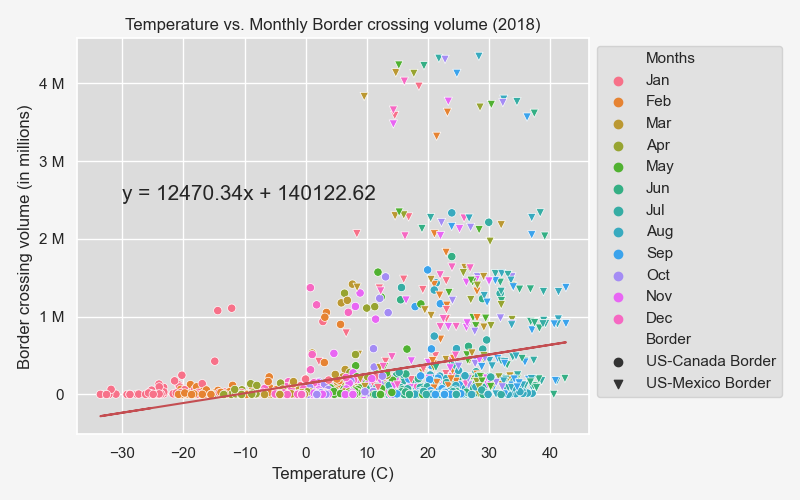

# US Border Crossing Data

## Introduction

This project analyzes in-bound US border crossing activity from 2009 to 2018.

*Data Sources*

There are two data sources used for this analysis. The first is a data set from [Kaggle about border crossing entry data from the Bureau of Transportation Statistics (BTS)] (https://www.kaggle.com/datasets/akhilv11/border-crossing-entry-data) . It provides information regarding inbound crossings at the U.S.-Canada border and the U.S.- Mexico border between 1996 to 2019. It provides information about the volume of both vehicle traffic and people traffic. It provides the date of each activity, the border port name, the border port code, the states in which the ports are located, the traffic types, traffic volume and the location coordinates for the ports. The original CSV file has 346733 data entries. 

The second data source is historical weather conditions from [OpenWeatherMap API] (https://openweathermap.org/api/history-api-timestamp ). The data includes information about Temperature, Humidity, Cloudiness, Wind speed, and Weather condition for 2018.

## Data Cleaning and Methodology

This project has 4 Jupyter Notebook files for data cleaning and analysis:

1.	border_crossing_analysis – includes data cleaning for first source and analysis
2.	weather_data_retrieval – includes weather data retrieval from OpenWeatherMap API
3.	weather_data_analysis – includes analysis of border crossing traffic based on weather data
4.	statistical_analysis – statistical analysis to evaluate the significance of average border crossing volume for each year

The methodology includes filtering, grouping and sorting data in various forms. There are several charts prepared throughout the analysis which are saved in the Images folder. The syntax to display the charts is then commented out to avoid overwriting the images every single time we re-run the Jupyter Notebbok.

# *Border Crossing Data*

For weather-related analysis, we narrowed our time frame to just 2018 and grouped the data so we had only one row for each Port Name (116 unique Ports) based on the unique timestamp (one timestamp for each month in 2018). The data was narrowed down to one year because there was limit on OpenWeatherMap API for historical data retrieval of 2000 entries per day even with subscription. The retrieved data for five different weather variables were added to the dataset which was then imported to another CSV.

# *Weather Data*

For weather-related analysis, we narrowed our time frame to just 2018 and grouped so we had only one row for each Port Name (116 unique Ports) based on unique timestamp (one timestamp for each month in 2018). The reason for narrowing data for one year was that there was limit on OpenWeatherMap API for historical data retrieval of 2000 entries per day even with subscription. The retrieved data for five different weather variables were added to the dataset which was then imported to another CSV.

## Limitations

The limitations of the border crossing data were that it only had information for a limited time period and that it only showed activity for inbound US border crossing date. The data set only had information up to 2019 and the 2019 data only went up to February. Had we had access to information up to possibly 2022, we could have provided some more current insight. For the purposes of our project, we chose to analyze a 10-year span from 2009 to 2018 as those were the most recent years with information available for the entire years.

## Analysis and Findings

The data analysis sections in the Jupyter Notebooks investigate the research questions posed which center around US border activity.  Both the US-Canada border traffic and US-Mexico border traffic are examined within this analysis. Traffic is categorized into segments: people traffic and vehicle traffic. The values in the column ‘Measure’ differentiate the border crossing traffic for people vs vehicles. Within each traffic segment, the areas covered include the busiest border, the busiest ports at each border, the states with the most border activity and the months with the most activity between 2009 and 2018. Busy is defined as the volume of people traffic and vehicle traffic across these two borders. The analysis also includes correlation statistics between border activity and the weather conditions for the year 2018.  

# *Question 1 - What’s the busiest border for the US?*

There are two borders for the US: the US-Canada Border and the US-Mexico Border.  Two bar graphs were created to answer this question. One bar graph looked at the people traffic while the second bar graph looked at the vehicle traffic. Next to each of the bar graphs below, there is a table that shows the raw count of what makes up the bar graphs. 

The people traffic for the US-Mexico border is 3 times higher than the US-Canada border overall across the 10 years analyzed i.e. 2009-2018. The US-Mexico border has 1.2 billion more people crossing the border overall. The vehicle traffic for the US-Mexico border is also 2 times higher than the traffic across the US-Canada border. The US-Mexico border has 380 million more vehicles crossing the border overall. For both the people and vehicle traffic, the US-Mexico border has an upward tick of activity from 2012 to 2018, jumping about 23% for its vehicle traffic and jumping about 21% for its people traffic. For both the US-Mexico border and the US-Canada border, the people traffic is much higher in general.

# *Question 2 - Which are the top 5 busiest ports between US and Canada?*

For this question, line graphs were used to look at the people traffic and the vehicle traffic across the US-Canada border.

Across the US-Canada border, between 2009 to 2018, the top five busiest ports overall are Buffalo-Niagara Falls, Blaine, Champlain-Rousses Point, Detroit and Port Huron. The top two busiest ports for people traffic are Buffalo-Niagara Falls and Blaine. Both of these ports are close to metropolitan cities and are located towards the end of US-Canada border line.  For its vehicle traffic, the top two busiest ports are Buffalo-Niagara Falls and Detroit. There is an increase in people traffic from 2010-2012 for the ports in Buffalo-Niagara Falls and Blaine, then there is a decline from 2013 and another uptick starting in 2017. The people and vehicle traffic for at the Champlain-Rousses Point port stays relatively steady across the year compared to the other busy ports.

# *Question 3: Which are the top 5 busiest ports between US and Mexico?*

Similar to question 2, for this question, line graphs were used to look at the people traffic and the vehicle traffic across the US-Mexico border. However, because there are significantly less ports across the US-Mexico border, bar graphs were also included to provide some additional insight.

The top 5 busiest ports for both people traffic and vehicle traffic across the US-Mexico border between 2008 ans 2019 are San Ysidro, El Paso, Laredo, Otay Mesa and Hidalgo. The top two busiest ports across both people traffic and vehicle traffic are San Ysidro and El Paso; these ports are near metropolitan cities. Across these two ports, there is a decrease from 2009 to end 2012 then a steady increase as of 2013 across both ports. From the busiest port across the US-Mexico border i.e. San Ysidro, there is on average about 2.5 times people crossing the border than there are vehicles.

# *Question 4 - Which are the top three busiest states between US and Canada?*

For this question, both bar graphs and line graphs were used to draw some observations.

Across the US-Canada border, the top three busiest states are Michigan, New York and Washington. Michigan has the most vehicle traffic followed by New York at a close second. New York has on average the most people traffic followed by Washington. New York has about 1.5 times more people traffic than Washington. New York remains the busiest state overall for both vehicle and people traffic showing a more consistent traffic trend lines across the years. In New York, there is a significant difference between the number of people crossing the border versus vehicles crossing the border. The people traffic is about 2 times more. In regards to both vehicle and people traffic, the volumes increased between 2009 and mid-2012 for the top three busiest states then started to decrease. Of the three, Michigan has remained relatively steady across the years whereas New York and Washington show greater volatility in their decline. Zooming out, the busiest states also coincide with the busiest ports along the US-Canada border i.e. New York and Washington. For the people traffic, New York is on average 7 times busier than Vermont on average. For vehicle traffic, Michigan is on average on 10 times busier than Vermont on average.

# *Question 5: Which are the top 3 busiest states across US-Mexico border?*

For this question, both bar graphs and line graphs were used to draw some observations.

Across the US-Mexico border, the top three busiest states for both people and vehicle traffic are Texas, California and Arizona. Texas has 1.2 times more people traffic than California. Texas remains the busiest state overall for both vehicle and people traffic; there was a decrease in traffic in this state from 2009 to 2011 then an upward increase since 2012. In Texas, there is a significant difference between the number of people crossing the border versus vehicles crossing the border; the people traffic is about 2 times higher.  In regards to both vehicle and people traffic, the volumes increased between 2009 and 2011, for Texas and California and then start to trend upward. Of the three, Arizona has remained relatively steady across the years.  Zooming out, the busiest states also coincide with the business ports along the US-Mexico i.e. Texas and California. For the people traffic, Texas is 36 times busier than New Mexico. For vehicle traffic, Texas is 5 times busier than New Mexico.

# *Question 6: Which vehicle types are used the most?*

For this question, we used both a pie chart and horizontal stacked bar graph to make some observations.

Personal vehicles represent 79.7% of the vehicle volume across the 10 years followed by trucks at 8.8%. For Canada, the use of personal vehicles increased from 2009 to 2013 and then has declined ever since. For Mexico, the use of vehicles declined from 2009 to 2012 and has increased ever since.

# *Question 7: Which months are the busiest on US borders?*

For this question, the following graphs were used: a vertical stacked graph, bar graphs and a pie chart.

Across the two borders, the busier months across the years are July representing 9.3% of the border activity followed by August representing 9.4% of the border activity. The two months with the least amount of activity across the years are February representing 7.2% of the border activity followed by January representing 7.8% for the border activity. Overall, however, there isn’t one month in particular that has significantly more activity than others.

# *Question 8: Do weather conditions impact the border crossing traffic volume?*

# Temperature vs. Average Monthly Border traffic

There does not seem to be any impact on traffic coming to US based on temperature (in Celsius). The r-value of 0.2943 signifies very weak positive correlation. Comparing between the two borders, US-Canada border has an r-value of 0.14 which again confirms very weak positive correlation between temperature and average monthly border traffic. The US-Mexico border has an r-value of -0.11 showing very weak negative correlation between temperature and average monthly border traffic. Overall, these two factors do not seem to be correlated.

# Humidity vs. Average Monthly Border traffic

There does not seem to be any impact on traffic coming to US based on humidity levels. The r-value of -0.1892 signifies very weak negative correlation. Comparing between the two borders, US-Canada border has an r-value of 0.06 which again confirms almost no correlation between humidity and average monthly border traffic. The US-Mexico border has an r-value of 0.16 showing very weak positive correlation between humidity and average monthly border traffic. Overall, these two factors do not seem to be correlated.

# Cloudiness vs. Average Monthly Border traffic

There does not seem to be any impact on traffic coming to US based on cloudiness levels. The r-value of -0.1265 signifies very weak negative correlation. Comparing between the two borders, US-Canada border has an r-value of almost zero which again confirms almost no correlation between cloudiness and average monthly border traffic. The US-Mexico border has an r-value of 0.01 showing almost no correlation between cloudiness and average monthly border traffic. Overall, these two factors do not seem to be correlated.

# Wind Speed vs. Average Monthly Border traffic

There does not seem to be any impact on traffic coming to US based on wind speed (m/s). The r-value of 0.1953 signifies very weak positive correlation. Comparing between the two borders, US-Canada border has an r-value of 0.07 which again confirms almost no correlation between wind speed and average monthly border traffic. The US-Mexico border has an r-value of 0.15 showing vey weak correlation between wind speed and average monthly border traffic. Overall, these two factors do not seem to be correlated.

*Summary*

Overall, there does not seem to be any significant correlation between any of the weather conditions and average monthly border traffic across US border. 

## Statistical Analysis

A random sample was extracted which was equivalent to 10% of the population. A scatterplot was generated to analyze the average border crossing volume for each year from the random sample and population datasets. One sample t-test was conducted which showed a p-value 0.930099. This implies that the random sample is a true representation of the population and statistically significant.

## Conclusion

There are a few observations that stood out in this analysis. There is consistently more activity across the US-Mexico border than across the US-Canada border. The most border activity along the US-Canada border happens in the New York region and the most border activity along the US-Mexico border happens in the Texas region. The summer months show the most border activities however not by a significant amount.