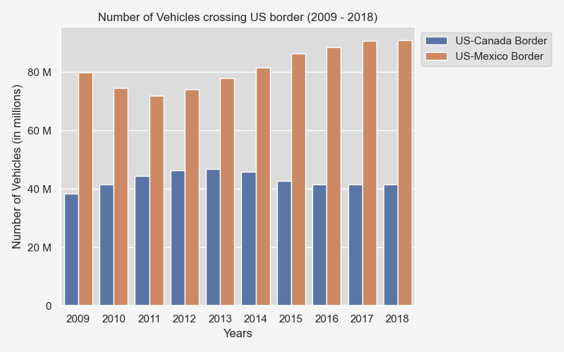
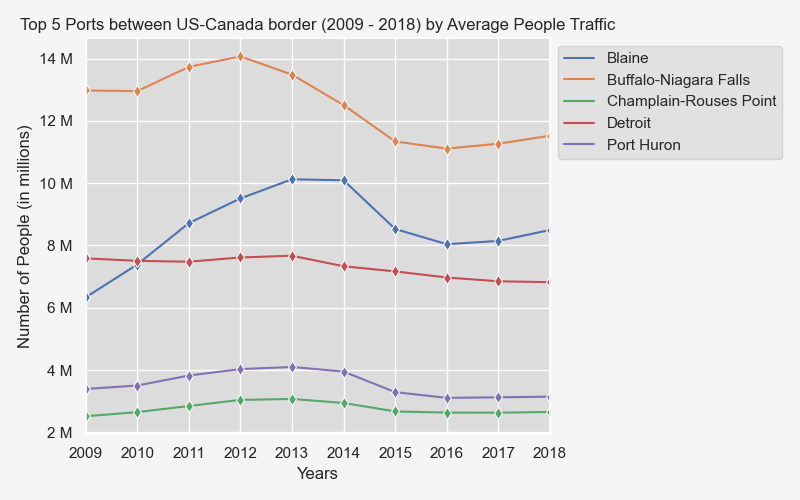
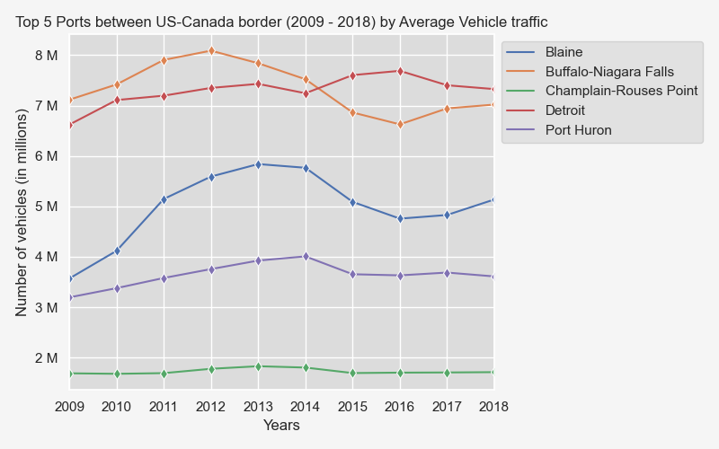
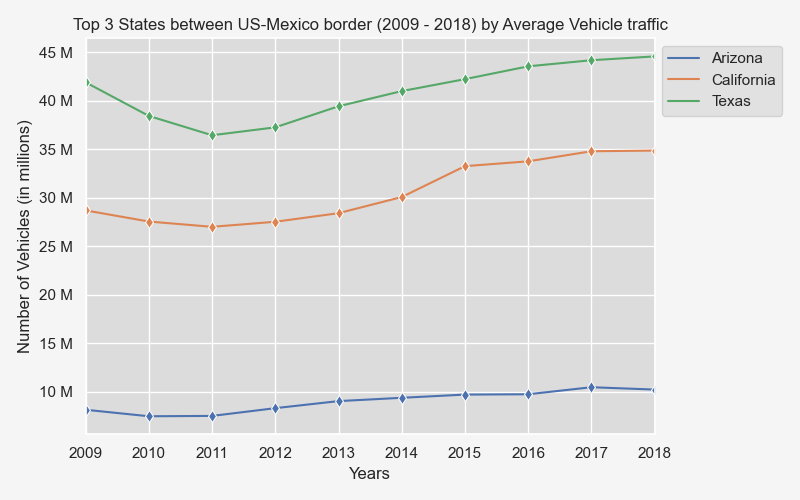
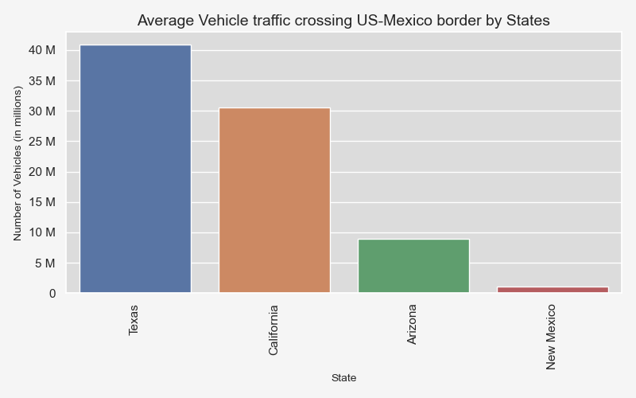
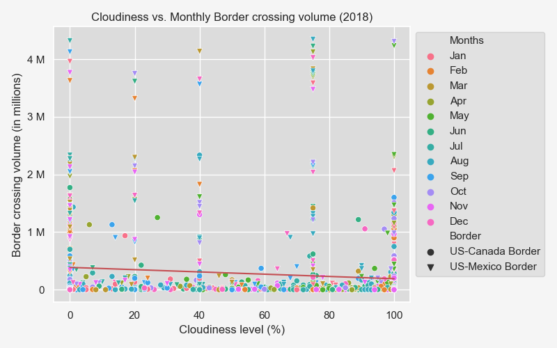

# US Border Crossing Data

## Introduction

There are two data sources used for this analysis. The first is a data set from [Kaggle about border crossing entry data from the Bureau of Transportation Statistics (BTS)] ( https://www.kaggle.com/datasets/akhilv11/border-crossing-entry-data ) . It provides information regarding inbound crossings at the U.S.-Canada border and the U.S.- Mexico border between 1996 to 2019. The second data source is historical weather conditions from [OpenWeatherMap API] (https://openweathermap.org/api/history-api-timestamp ). The data includes information about Temperature, Humidity, Cloudiness, Wind speed, and Weather condition for 2018.

The border crossing data set provides information about the volume of both vehicle traffic and people traffic. It provides the date of each activity, the border port name, the border port code, the states in which the ports are located, the traffic types, traffic volume and the location coordinates for the ports. The original CSV file has 346733 data entries. 

## Data Cleaning and Methodology

The project has 4 Jupyter Notebook files for data cleaning and analysis:

1.	border_crossing_analysis – includes data cleaning for first source and analysis
2.	weather_data_retrieval – includes weather data retrieval from OpenWeatherMap API
3.	weather_data_analysis – includes analysis of border crossing traffic based on weather data
4.	statistical_analysis – statistical analysis to evaluate the significance of average border crossing volume for each year

The methodology includes filtering, grouping and sorting data in various forms. There are several charts prepared throughout the analysis which are saved in the Images folder. The syntax to display the charts is then commented out to avoid overwriting the images every single time we re-run the Jupyter Notebbok.

# *Border Crossing Data*

The first step in our data cleaning process was to filter out data from 2009 to 2018. The format for ‘Date’ column was originally string and although the value had year, month, day and time but there was only one date for each month which implies that it was monthly data. We converted the values in this column to ‘datetime’ format as well as retrieved the ‘timestamp’ formatted data in a separate column. The datetime data was split into year, month and date values.

The ‘Location’ column had longitude and latitude values but in one cell. We used string split function to retrieve latitude and longitude values and stored them in separate columns.
Next, we dropped the columns we did not need which were ‘Port Code’ and original columns for ‘Date’ and ‘Location’. Then we filtered the data to our targeted analysis period of Jan-2009 to Dec-2018 which included 144605 data entries. This final retrieved dataset was then exported to a CSV file.

# *Weather Data*

For weather-related analysis, we narrowed our time frame to just 2018 and grouped so we had only one row for each Port Name (116 unique Ports) based on unique timestamp (one timestamp for each month in 2018). The reason for narrowing data for one year was that there was limit on OpenWeatherMap API for historical data retrieval of 2000 entries per day even with subscription. The retrieved data for five different weather variables were added to the dataset which was then imported to another CSV.

## Limitations

The limitations of the border crossing data set were that it only had information up to 2019 and the 2019 data only went up to February. Had we had access to information up to possibly 2022, we could have provided some more insight. There is also the issue of the data set only showing inbound border activity to the US nor outbound. For the purposes of our project, we chose to analyze a 10-year span from 2009 to 2018 as those are the most recent years with information from the entire year.

## Analysis and Findings

The data analysis sections in the Jupyter Notebooks investigate the research questions for this project which centers around US border activity.  Both the US-Canada border traffic and US-Mexico board traffic are examined within this analysis. Traffic is categorized into segments: people traffic and vehicle traffic. The values in the column ‘Measure’ differentiate the border crossing traffic for people vs vehicles. Within each traffic segment, the areas covered include the busiest border, the busiest ports at each border, the states with the most border activity and the months with the most activity between 2009 and 2018. The analysis also includes correlation statistics between border activity and the weather conditions for the year 2018. In this analysis, busy is defined as the volume of people traffic and vehicle traffic across these two borders. 

# *Question 1 - What’s the busiest border for the US?*

# *Question 2 - Which are the top 5 busiest ports between US and Canada?*

# *Question 3: Which are the top 5 busiest ports between US and Mexico?*

# *Question 4 - Which are the top three busiest states between US and Canada?*

# *Question 5: Which are the top 3 busiest states across US-Mexico border?*

# *Question 6: Which vehicle types are used the most?*

# *Question 7: Which months are the busiest on US borders?*

# *Question 8: Do weather conditions impact the border crossing traffic volume?*

# Temperature vs. Average Monthly Border traffic

# Humidity vs. Average Monthly Border traffic

# Cloudiness vs. Average Monthly Border traffic

# Wind Speed vs. Average Monthly Border traffic

*Summary*

## Statistical Analysis

## Conclusion
